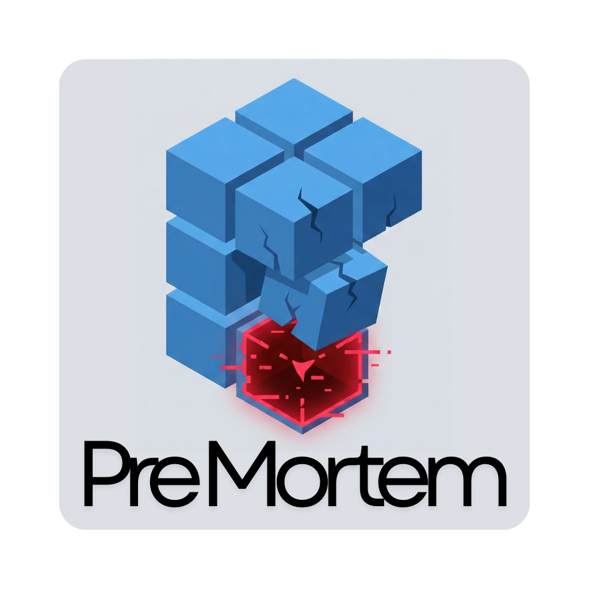

# Project Pre-Mortem: Enterprise Risk Visualization



> *"Optimism is a bug. Physics is the feature."*

<video src="./public/pre-mortem.mp4" controls width="100%"></video>

**Pre-Mortem** is a deterministic simulation engine designed to quantify the structural integrity of high-growth organizations. By mapping technical debt, venture capital hype, and organizational friction to Matter.js physics bodies, we provide stakeholders with a high-fidelity forecast of institutional entropy.

## Use Case (Operational Objectives)

* **For Engineers:** Empirically visualize why adding "Generative AI" to a fragile foundation results in immediate structural collapse.
* **For Product Managers:** A tactical demonstration of how feature creep scales linearly with institutional gravity.
* **For Founders:** A high-stakes anxiety simulator to optimize exit timing before the runway reaches terminal velocity.

## Architecture (The Metaphors)

The simulation utilizes three core primitives to model corporate reality:

### 1. The Foundation (Legacy & Infrastructure)

* **Attributes:** High Density, High Friction, Zero Restitution.
* **Components:** Refactoring, Unit Testing, Compliance, Infrastructure.
* **Dynamics:** Essential yet heavy. Without a stable base, capitalization metrics are irrelevant.

### 2. The Growth Factors (Capital & Hype)

* **Attributes:** Low Density, High Elasticity, Asymmetric Geometry.
* **Components:** Strategic Pivots, Thought Leadership, Market Noise.
* **Dynamics:** Rapidly inflates vertical valuation while introducing catastrophic center-of-gravity shifts.

### 3. Organizational Friction (Culture)

* **Dead Wood:** Inert hulls that consume space and runway without contributing to structural support.
* **Toxic Agents:** The Slacker (Zero friction), The Prima Donna (Hostile geometry), The Control Freak (Unpredictable impulse vectors).

## Quick Start

### Library Integration

Integrate the simulation into your corporate dashboard for "educational" purposes.

```bash
npm install pre-mortem
```

```typescript
import { PreMortem } from 'pre-mortem';

const simulation = new PreMortem(document.body, {
  logoUrl: "/api/assets/corporate-logo.png",
  initialRunway: 5000000,
  stages: [
    { name: 'Seed Phase', threshold: 0, burnRate: 2000 },
    { name: 'Terminal Growth', threshold: 1000000000, burnRate: 500000 }
  ]
});

simulation.start();
```

### Standalone Deployment

```bash
git clone https://github.com/your-org/pre-mortem.git
cd pre-mortem
npm install
npm run dev
```

## Chaos Events (Stochastic Crises)

The engine monitors valuation thresholds to trigger real-world market stressors:

* **Strategic Pivot**: CEO intervention causes a temporary localized gravity shift.
* **The Big Reorg**: Friction is zeroed across all human capital assets.
* **Market Shockwave**: High-impulse forces applied to specialized structural nodes.

## Contributing

Technical contributions are welcome. Please ensure all new hype-based blocks have a density less than 0.001 to maintain institutional realism.

## License

ISC. Implement at your own career risk.